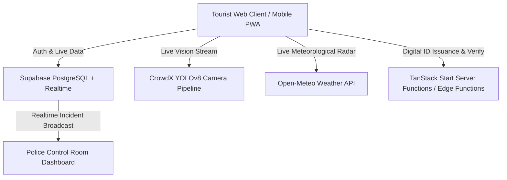

# BEACON — Smart Tourist Safety & Incident Response System

BEACON is an intelligent tourist safety companion and incident response platform designed for travelers in Tamil Nadu. It integrates real-time GPS tracking, computer-vision crowd density monitoring via CrowdX (YOLOv8), live meteorological hazard alerts via Open-Meteo, cryptographic Digital IDs with tamper-evident blockchain verification, and a live SOS incident lifecycle dispatch directly connected to police command rooms.

---

## 🏛️ System Architecture

BEACON uses a modern full-stack architecture combining a reactive TypeScript frontend, serverless server functions via Nitro/TanStack Start, a Supabase PostgreSQL database with Row Level Security (RLS), and live computer vision streams:



### Backend Components

1. **Database & Persistence (Supabase PostgreSQL)**
   - Schema tables: `profiles`, `user_roles`, `digital_ids`, `id_ledger`, `geofence_zones`, `location_pings`, `alerts`, `efir_records`, `police_stations`.
   - Security: Row-Level Security (RLS) policies enforcing user authorization and police administrative access.
   - Real-time: PostgreSQL change feeds (`alerts-live`, `tourist-alerts-live`) for live dispatch progression.

2. **Server Functions & Edge Functions**
   - `generateDigitalId`: Server function (`src/lib/digital-id.functions.ts`) and Edge function (`supabase/functions/generate-digital-id`) for cryptographic SHA-256 tamper-evident hash chaining on `id_ledger`.
   - `verifyDigitalId`: Recomputes verification hashes to detect data tampering.
   - `translate-text`: Edge function (`supabase/functions/translate-text`) and client fallback pipeline for speech/text translation between English, Tamil, Hindi, French, Spanish, etc.

3. **CrowdX Vision Integration (Chennai Crowd Watch)**
   - Real-time WebSocket connection to CrowdX YOLOv8 RTSP streaming cameras (`/ws/stream/{camera_id}`).
   - Automatic pedestrian counting, capacity threshold calculation, and crowd surge detection.

4. **Weather & Proximity Intelligence**
   - Open-Meteo meteorological feed using live device GPS coordinates.
   - Comprehensive Tamil Nadu Police station directory (`src/lib/police-stations.ts`) for accurate proximity calculation and SOS dispatch.

---

## 🚀 Getting Started

### Prerequisites

- **Node.js**: v18.0.0 or higher
- **npm** or **bun**

### Installation

```bash
# Clone the repository
git clone https://github.com/diveshchoyal/beacon-trip-guard.git
cd beacon-trip-guard

# Install dependencies
npm install
```

### Environment Configuration

Copy `.env.example` to `.env` and fill in your Supabase credentials:

```bash
cp .env.example .env
```

```env
# Required for Supabase Database & Auth
VITE_SUPABASE_PROJECT_ID="your_supabase_project_id"
VITE_SUPABASE_PUBLISHABLE_KEY="your_supabase_publishable_anon_key"
VITE_SUPABASE_URL="https://your_supabase_project_id.supabase.co"

# Optional CrowdX Computer Vision stream
# VITE_CROWDX_WS_URL="ws://localhost:8000"
# VITE_CROWDX_API_URL="http://localhost:8000"
```

### Running Locally

```bash
# Start development server
npm run dev

# Build for production
npm run build

# Preview production build
npm run preview
```

---

## 📱 Application Modules

- **Tourist Homepage (`/app`)**: Personalized greeting, 3D mascot earth atmosphere, live reverse-geocoded GPS, real crowd density, nearest police unit, live weather, and quick safety actions.
- **Alert & Incident Response (`/app/alerts`)**: Proactive surrounding intelligence (CrowdX surges, geofence perimeters, severe weather), 3-second safeguard countdown SOS trigger, real-time incident lifecycle tracker (`Sent` $\rightarrow$ `Acknowledged` $\rightarrow$ `Dispatched` $\rightarrow$ `Resolved`), and alert history management.
- **Interactive Safety Map (`/app/map`)**: Leaflet-based interactive tourist map of Tamil Nadu with geofenced safety perimeters, safety filters, and time-of-day safety simulation.
- **Digital ID (`/app/id`)**: Tamper-evident blockchain-style QR Digital ID with SHA-256 ledger verification.
- **Voice Translator (`/app/translate`)**: Two-way bilingual voice and text translator for instant communication with local authorities.
- **Police / Admin Dashboard (`/dashboard`)**: Live incoming SOS radar, tourist registry, E-FIR generator, and response unit dispatch console.

---

## 🔒 Security Best Practices

- **Zero Secret Exposure**: `.env` and sensitive credentials are excluded from Git tracking via `.gitignore`.
- **Row-Level Security**: Supabase PostgreSQL tables strictly restrict write operations to authenticated user IDs and police administrators.
- **Service Role Isolation**: High-privilege service keys live only in protected serverless edge runtimes, never on the client.
