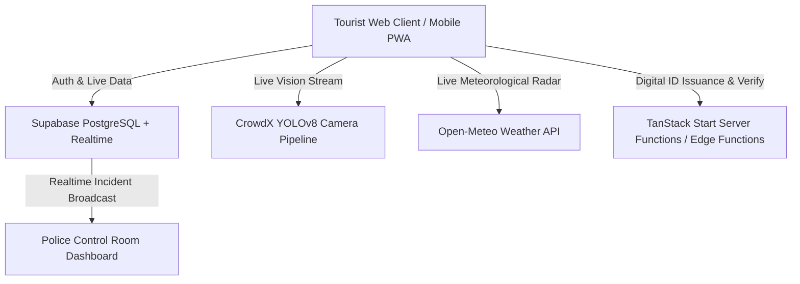

# BEACON — Smart Tourist Safety Monitoring and Incident Response System

**BEACON** is an intelligent tourist safety companion and incident response platform designed for travelers in Tamil Nadu. It integrates real-time GPS tracking, computer-vision crowd density monitoring via CrowdX (YOLOv8), live meteorological hazard alerts via Open-Meteo, cryptographic Digital IDs with tamper-evident blockchain verification, and a live SOS incident lifecycle dispatch directly connected to police command rooms.

---

## 🏛️ System Architecture



### Core Technologies

- **Frontend & SSR**: React 19, Vite, TanStack Start, Tailwind CSS, Framer Motion, Lucide Icons, Leaflet
- **Backend & Database**: Supabase PostgreSQL, Row-Level Security (RLS), Realtime WebSocket feeds
- **Edge Computing**: Supabase Edge Functions (Deno runtime) for cryptographic ledger anchoring and translation
- **Computer Vision**: CrowdX (YOLOv8) RTSP camera streaming & pedestrian density detection

---

## 🚀 Quick Setup & Installation

Follow these steps to run BEACON locally on your machine:

### 1. Prerequisites

Make sure you have installed:

- **Node.js**: v18.0.0 or higher (v20+ LTS recommended)
- **npm** (comes with Node.js) or **pnpm** / **bun**
- A modern web browser with Location/GPS permissions enabled

---

### 2. Clone the Repository

```bash
git clone https://github.com/diveshchoyal/beacon-trip-guard.git
cd beacon-trip-guard
```

---

### 3. Install Dependencies

```bash
npm install
```

---

### 4. Configure Environment Variables (`.env`)

Create your local `.env` file from the provided `.env.example` template:

```bash
# Windows PowerShell:
Copy-Item .env.example .env

# macOS / Linux / Git Bash:
cp .env.example .env
```

#### ⚠️ IMPORTANT: Use the Shared Team Supabase Project

> [!IMPORTANT]
> **Do NOT create a new blank Supabase project.**
> The PostgreSQL database schema, tables (`profiles`, `user_roles`, `digital_ids`, `id_ledger`, `geofence_zones`, `alerts`, `efir_records`, `police_stations`), RLS security policies, and deployed Edge Functions are already configured and live on the shared BEACON project.
>
> **Request the `.env` configuration values (`VITE_SUPABASE_PROJECT_ID`, `VITE_SUPABASE_PUBLISHABLE_KEY`, `VITE_SUPABASE_URL`) directly from the project owner (Divesh Choyal) or your team lead.**

Your `.env` file should look like this:

```env
# =========================================================================
# Supabase Configuration (Shared Team Project)
# =========================================================================
VITE_SUPABASE_PROJECT_ID="your_team_supabase_project_id"
VITE_SUPABASE_PUBLISHABLE_KEY="your_team_supabase_publishable_anon_key"
VITE_SUPABASE_URL="https://your_team_supabase_project_id.supabase.co"

# Optional Server-Side Mirror (used during Nitro SSR)
SUPABASE_PROJECT_ID="your_team_supabase_project_id"
SUPABASE_PUBLISHABLE_KEY="your_team_supabase_publishable_anon_key"
SUPABASE_URL="https://your_team_supabase_project_id.supabase.co"

# Optional CrowdX Computer Vision stream (Defaults to http://localhost:8000)
# VITE_CROWDX_WS_URL="ws://localhost:8000"
# VITE_CROWDX_API_URL="http://localhost:8000"
```

---

### 5. Run the Development Server

```bash
npm run dev
```

Open your browser and navigate to:

```
http://localhost:3000
```

_(or the local port displayed in your terminal by Vite / Nitro)_

---

## 🛠️ Common Troubleshooting

### ❌ Error: `"Failed to fetch"` on Login or Signup

If you click **Sign In** or **Create Account** and see a `"Failed to fetch"` error toast:

1. **Missing or Placeholder `.env`**:
   - Check that you created a `.env` file in the root folder and replaced placeholder values with the real shared Supabase credentials.
2. **Vite Server Restart Required**:
   - Vite and Nitro read `.env` variables **only at startup**. If you created or modified `.env` while the dev server was already running, you must **restart the dev server**:
     1. Press `Ctrl + C` in the terminal to stop the server.
     2. Run `npm run dev` again.
3. **Invalid URL or Protocol**:
   - Ensure `VITE_SUPABASE_URL` begins with `https://` and has no trailing spaces.

---

## ⚡ Supabase Edge Functions

The repository includes pre-built Supabase Edge Functions in [`supabase/functions/`](supabase/functions/):

- **`generate-digital-id`**: Computes SHA-256 cryptographic fingerprints of traveler identity and anchors them to `id_ledger` with tamper-evident proof.
- **`verify-digital-id`**: Recomputes hash chains on demand for public inspection and police verification at `/verify/$id`.
- **`translate-text`**: Cloud translation edge service for two-way tourist and officer communication.

> [!NOTE]
> These Edge Functions are **already deployed and active** on the shared Supabase project. Team members running the frontend locally do **not** need to install Deno or redeploy these functions unless modifying their source code.

---

## 📱 Application Modules & Navigation

- **Tourist Home (`/app`)**: Personalized greeting, flat-style vector mascot with breathing animation, live circular safety score gauge, real GPS coordinates and reverse geocoding, CrowdX YOLO crowd density, nearest police station proximity, and live meteorological weather hazards.
- **Alert & Incident Response (`/app/alerts`)**: Proactive surrounding hazards (CrowdX crowd surges, geofence perimeters, severe weather), 3-second safeguard countdown SOS dispatch, real-time incident lifecycle tracker (`Sent` $\rightarrow$ `Acknowledged` $\rightarrow$ `Dispatched` $\rightarrow$ `Resolved`), and alert history.
- **Interactive Safety Map (`/app/map`)**: Leaflet-based interactive tourist map of Tamil Nadu with geofenced safety perimeters, real-time filters, and safety simulation.
- **Digital ID (`/app/id`)**: Tamper-evident blockchain-style QR Digital ID with 15-minute expiring credential pass, instant manual creation, and SHA-256 ledger proof.
- **My Documents Wallet (`/app/profile`)**: Secure document storage for Passport, Travel Visa, and Citizen ID with private Supabase Storage photo uploads, temporary signed URLs, thumbnail cards, and full-size photo viewer.
- **Voice Translator (`/app/translate`)**: Two-way bilingual voice and text translator for instant communication with local authorities.
- **Police & Responder Dashboard (`/dashboard`)**: Real-time incoming SOS radar, tourist registry, E-FIR generator, and response unit dispatch console.

---

## 🔒 Security & Repository Policy

- **Zero Secret Exposure**: `.env` and local environment files are strictly excluded from Git via `.gitignore`.
- **Row-Level Security (RLS)**: Database tables enforce strict user isolation and role-based policies.
- **Cryptographic Verification**: Digital IDs use one-way SHA-256 hashing and never expose raw sensitive PII inside QR payloads.

---

## 📜 Available Scripts

| Command           | Description                                           |
| :---------------- | :---------------------------------------------------- |
| `npm run dev`     | Starts the local development server                   |
| `npm run build`   | Builds the client and Nitro server production bundles |
| `npm run preview` | Previews the local production build                   |
| `npm run format`  | Formats the codebase using Prettier                   |
| `npx eslint .`    | Runs ESLint analysis across all source files          |
